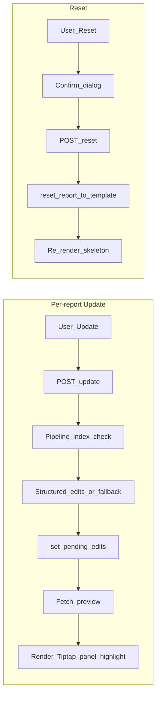

# Project Context: Secure Agentic Multi-Modal RAG MVP

> CyberScribe setup: see [README.md](../README.md) for current installation and startup commands. Earlier planning documents retain historical names.

> **Superseded as the read-first doc:** Use [PROJECT_MASTER.md](PROJECT_MASTER.md) for the full picture (motivation, product, technical, roadmap). This file remains for focused reference.

**Purpose of this document:** Give any reader (human or AI) a complete, holistic view of the project so they can work on it without re-reading transcripts or re-exploring the codebase. Read this file first when joining the project or starting a new chat about it.

---

## 1. What This Project Is

- **Name:** CyberScribe (CyberScribe).
- **Proposal copy:** Stakeholder-facing lead sentence and supporting bullets — [PLATFORM_VALUE_PROPOSAL.md](PLATFORM_VALUE_PROPOSAL.md).
- **Goal:** Mission-isolated, locally hosted RAG pipeline for CPT (mission) documents. Users start missions in the UI with a **mission name**, **document pick-up path** (source), and **drop-off path** (where to write final reports). The system ingests from the source folder, builds a vector index, and generates **RMP (Risk Mitigation Plan)** and **Mission Timeline** drafts. Users review (accept/reject/edit) in the UI. Built for long runs (e.g. ~5 months) with an optional daily scheduler.
- **“Agentic” here:** Two specialized **agents** (RMP agent, Timeline agent), each with its own retriever and system prompt. **Orchestration is deterministic Python code** in `pipeline.py` and `server.py` — there is **no** main “router” or LLM that decides which sub-agent to call. The pipeline always runs both agents per mission when you run the pipeline.
- **Single UI:** FastAPI + Liquid Glass (HTML/CSS/JS) only. Streamlit was removed; no `app.py`.

---

## 2. High-Level Architecture

```
User (browser)  →  http://localhost:8000
       ↓
  index.html + Vite bundle (app + Tiptap) + styles  (Liquid Glass SPA)
       ↓
  FastAPI (server.py)  ← uvicorn
       ├── REST: /api/missions, /api/missions/{id}/evidence-delta (Phase 4), /api/run-pipeline, /api/.../reports/.../accept|reject|save|preview|pending-edits|inline-assist|edits/{id}/accept|edits/{id}/reject|accept-all-edits|reject-all-edits|apply-edits|update|reset, **Phase 5:** `PATCH .../review-status`, `GET|POST .../comments`, `GET .../approval-log`, `POST .../finalize`, /api/status
       ├── SSE:  /api/stream/{mission_id}/{report_type}  (live RMP/Timeline streams)
       └── Static: `web/dist` after `npm run build` (required)
       ↓
  Pipeline (background thread): if !mission_index_exists then build_mission_index else skip; structured edits (LLM JSON per block) for RMP/Timeline/AAR/SITREP; fallback full-draft RAG + synthetic pending edit when no valid edits; set_pending_edits or set_pending; push to SSE
       ↓
  src/: mission_service, report_service, index (build, vectorstore), retrieve (retriever), agents (base, report_agents), templates (prompts), ingest (loaders, chunking), utils (context_cleaner), scheduler
       ↓
  SQLite (data/agentic_rag.db) + FAISS indexes (data/indexes/<mission_id>/)
```

- **Front-end:** One SPA. Hash routing (`#/`, `#/new`, `#/mission/<id>`, `#/mission/<id>/overview`, `#/mission/<id>/<report_type>`, `#/mission/<id>/documents`). All API calls go to `/api/...`. SSE for live stream boxes.
- **Backend:** One FastAPI app. Pipeline runs in a daemon thread; clears `stream_buffers` at pipeline start so “reject then run” doesn’t show old + new mix. Writes to DB and (for UI) to mission `output_path` only on Accept or Save.

---

## 3. Stack and Dependencies

| Layer | Technology |
|-------|------------|
| **Server** | FastAPI, uvicorn (ASGI). Run: `uvicorn server:app --host 0.0.0.0 --port 8000` |
| **Front-end** | `web/index.html`; TypeScript in `web/app.ts`, `web/tiptap-editor.ts`, entry `web/main.ts`. **Vite** (`npm run build`) outputs `web/dist/` with hashed `/assets/*`; FastAPI serves that when `web/dist/index.html` exists. `web/styles.css` (Liquid Glass + Tiptap page shell). Rich text: **Tiptap / ProseMirror** (HTML in/out for save/DOCX). |
| **RAG** | LangChain (loaders, splitter, vector store API, retriever, prompts, ChatOllama, chain). FAISS as vector store (optional Chroma via `VECTOR_STORE_TYPE=chroma`) |
| **Embeddings** | sentence-transformers (default `all-MiniLM-L6-v2`) via LangChain `HuggingFaceEmbeddings`; optional Ollama embeddings |
| **LLM** | Ollama (default model `phi3` = Phi-3 Mini, 3.8B). Optional second Ollama instance for parallel RMP + Timeline (`OLLAMA_BASE_URL_RMP`, `OLLAMA_BASE_URL_TIMELINE`) or `OLLAMA_NUM_PARALLEL=2` |
| **DB** | SQLite at `data/agentic_rag.db` |
| **Scheduler** | APScheduler; daily run at 02:00 for all active missions (`python run_scheduler.py`) |

- **requirements.txt:** langchain-core, langchain-community, langchain-text-splitters, faiss-cpu, sentence-transformers, pypdf, python-docx (DOCX input/output), apscheduler, fastapi, starlette, pydantic, uvicorn, bcrypt, xhtml2pdf, python-dotenv. Optional: chromadb. Research tools are in requirements-research.txt.
- **package.json:** Vite + Tiptap (devDependencies). `npm run build` runs `vite build` → `web/dist/`. Optional `npm run typecheck` (`tsc --noEmit`). No Node at runtime for the served app.

---

## 4. Repository Layout (Every Important File)

### Root

| File | Role |
|------|------|
| **server.py** | FastAPI app: REST routes, SSE streaming, pipeline thread (`_run_pipeline`), static mount for `web/dist/assets` (when dist exists) + SPA from `WEB_ROOT` (`web/dist`, built with Vite), SPA fallback. Pipeline uses `_run_structured_edits` for report types in `USE_STRUCTURED_EDITS_FOR`; checks `mission_index_exists` before building index; handles queue messages `"edits"` (set_pending_edits) and `"sources"` (set_pending for legacy path). Exposes `.../preview`, `.../pending-edits`, `.../inline-assist` (Phase 3 scoped LLM), `.../reset`, `.../update`, and edit accept/reject/apply endpoints. **Phase 5:** `request_mission_update` omits MEL-approved/final report types; `409` on save/apply/accept/reset/edits when `review_status` is `final`, and on update/inline-assist when MEL-approved or final; review-status, comments, approval-log, finalize routes. State: `stream_buffers`, `stream_queues`, `stream_lock`, `running_mission_id`. |
| **run.py** | CLI: `build <mission_id> [--source PATH]`, `run <mission_id> [--sequential]`, `all <mission_id> [--source] [--sequential]`. Uses `build_mission_index` and `run_all_report_agents`. |
| **run_scheduler.py** | Entrypoint for daily pipeline: `init_db()`, `start_scheduler()`, then sleep loop; Ctrl+C shuts down scheduler. |
| **requirements.txt** | Python deps (see above). |
| **package.json** | `npm run build` → Vite; `npm run typecheck` → `tsc --noEmit`. |
| **vite.config.ts** | Vite root `web/`, output `web/dist/`. |
| **tsconfig.json** | Typecheck `web/**/*.ts` (bundling by Vite). |
| **.gitignore** | .venv, .env, __pycache__, data/missions/* (keep .gitkeep), data/indexes/, data/agentic_rag.db, output/, *.faiss, *.pkl, node_modules, web/dist/. |

### config/

| File | Role |
|------|------|
| **settings.py** | Loads .env: OLLAMA_BASE_URL, OLLAMA_MODEL (phi3), OLLAMA_BASE_URL_RMP/TIMELINE, EMBEDDING_PROVIDER/MODEL, VECTOR_STORE_TYPE, DATA_DIR, MISSIONS_DIR, INDEX_DIR, OUTPUT_DIR. `get_ollama_base_url_for_report(report_type)`. |
| **__init__.py** | Package marker. |

### src/

| File | Role |
|------|------|
| **db/models.py** | SQLite: DB_PATH, REPORT_TYPES=(rmp, timeline, aar, sitrep), _slug(name), get_connection(), init_db() (missions, reports, pending_edits tables). pending_edits: edit_id, section_id, target_block_id, operation, reason, evidence_refs, old_html, new_html, status, ord. Optional mission columns: cpt, workflow_title, start_date, end_date, operators, mel, ccl_host, ccl_network, auto_update_frequency. **Phase 5:** `reports.review_status`; tables `report_comments`, `report_approval_events`. |
| **mission_service.py** | ensure_db, create_mission (slug from name, unique id; inserts one report row per REPORT_TYPES with template as initial current_content via get_document_template), list_missions, get_mission (exact id), update_mission_status, update_mission_last_ingest, update_mission_last_generated, reset_mission_reports_to_templates(mission_id) (recover from corrupted content). Status updates use LOWER(id). |
| **report_service.py** | get_report (includes `review_status`), set_pending(content, sources), accept_pending (write .docx via html_to_docx), reject_pending, save_user_edit. get_pending_edits, set_pending_edits, accept_edit, reject_edit, accept_all_edits, reject_all_edits, apply_accepted_edits (block-level: parse_html_to_blocks → apply_edits_to_blocks → blocks_to_html → write .docx; only accepted IDs removed from pending_edits). get_report_preview (current_content + pending edits applied, with highlight spans for the rich-text editor). reset_report_to_template(mission_id, report_type): single-report reset to skeleton; clears pending_content and pending_edits for that report; sets `review_status` to `draft`. **Phase 4:** after accept_pending, save_user_edit, apply_accepted_edits → `_touch_source_checkpoint` updates `missions.last_source_checkpoint_*`. _report_output_path: rmp→Risk_Mitigation_Plan.docx, timeline→Mission_Timeline.docx, aar→After_Action_Report.docx, sitrep→SITREP.docx. |
| **pipeline.py** | run_mission_cycle(mission_id): get_mission, build_mission_index, get_mission_retriever(rmp | timeline), do_rmp/do_timeline (run_template_rag_agent + set_pending), ThreadPoolExecutor(max_workers=2), update_mission_last_generated. run_all_active_missions: list active, run_mission_cycle per mission. |
| **scheduler.py** | BackgroundScheduler, cron 02:00, _scheduled_job → run_all_active_missions(), start_scheduler(cron). |
| **agents/base.py** | run_template_rag_agent (retriever.invoke(template_query), clean_context_for_llm, ChatOllama, prompt | llm | StrOutputParser, returns (content, sources)). run_template_rag_agent_stream: same but chain.stream(); yields ("chunk", str) then ("sources", list). System prompt: source text only, document creation only, first line = title, no code/refusals. |
| **agents/report_agents.py** | run_rmp_agent, run_timeline_agent (call run_template_rag_agent with RMP/Timeline template and prompt). run_all_report_agents: parallel or sequential, writes to output_dir/mission_id/rmp_draft.txt, timeline_draft.txt. |
| **index/build.py** | mission_index_exists(mission_id): returns True when by_type JSON and FAISS/Chroma exist so pipeline can skip rebuild. build_mission_index(mission_id, source_path): load_mission_documents, chunk_documents, _save_chunks_by_type (by_type/crew_log|findings|other.json), get_vectorstore(mission_id, chunks=...). |
| **index/vectorstore.py** | get_embeddings() (HuggingFace or Ollama). get_vectorstore(mission_id, documents=, chunks=): FAISS or Chroma; if chunks given, from_documents and save_local. _faiss_store, _chroma_store. |
| **retrieve/retriever.py** | FixedListRetriever(docs). _load_chunks_by_type(mission_id, doc_types). get_mission_retriever(mission_id, k=, report_type=): timeline→all crew_log; rmp→crew_log+findings+other; else FAISS as_retriever(k=k). |
| **ingest/loaders.py** | infer_doc_type(path, mission_path)→crew_log|findings|other. LOADER_MAP .txt/.pdf/.docx. load_file (adds source, mission_file), load_mission_documents (sets doc_type per doc). |
| **ingest/chunking.py** | chunk_documents(documents, chunk_size=1000, chunk_overlap=200), RecursiveCharacterTextSplitter, optional normalize. |
| **templates/prompts.py** | Template-as-query and generation prompts: RMP_TEMPLATE_QUERY, TIMELINE_TEMPLATE_QUERY, RMP_GENERATION_PROMPT, TIMELINE_GENERATION_PROMPT (place {context}); AAR and SITREP equivalents. Structured-edit prompts per report type: RMP_STRUCTURED_EDIT_PROMPT, TIMELINE_STRUCTURED_EDIT_PROMPT, AAR_STRUCTURED_EDIT_PROMPT, SITREP_STRUCTURED_EDIT_PROMPT. REPORT_SPECS / generation prompts used in fallback when LLM returns no valid structured edits. |
| **utils/context_cleaner.py** | clean_context_for_llm(context): drop lines matching hex, UUID/signature, repeated patterns so LLM doesn’t copy junk. |
| **sections.py** | Phase 4: `sections_to_update(mission_id, new_or_changed_items)` maps each file’s `doc_type` to likely `(report_type, section_key)` pairs (telemetry + overview UI). |
| **evidence_checkpoint.py** | Phase 4: `save_mission_source_checkpoint` on user commit; `evidence_delta_for_mission` for read-only UI/API. |
| **edit_dedupe.py** | Phase 4: `filter_near_duplicate_edits` drops structured edits whose new_html ≈ old_html (similarity). |
| **document_blocks.py** | Block-aware document representation: parse_html_to_blocks, blocks_to_html, apply_edits_to_blocks. Used for collaborative editor flow (LLM proposes edits per block; apply only accepted ones). |
| **merge_draft.py** | merge_llm_into_draft(current_draft, llm_output): merges LLM output into current draft/template, preserving structure; used when applying pipeline output. |
| **html_to_docx.py** | Converts HTML report content to .docx and writes to output_path; used by report_service on accept, save, apply_accepted_edits. |
| **templates/document_templates.py** | Structured HTML per report type: each section from `SECTION_DEFINITION_SEED` is wrapped in `<section class="report-section" data-section-key data-section-policy>`. `build_structured_template_html`, get_document_template, DOCUMENT_TEMPLATES. Pre-populate report rows on mission create; used by reset_report_to_template / reset_mission_reports_to_templates. |
| **inline_assist_service.py** | Phase 3: `run_inline_assist` — small retrieval (k≤4, semantic) when index exists; Ollama; returns `{ suggestion, evidence_sources }` only (no DB pending row). |
| **templates/inline_assist_prompts.py** | Action instructions + `build_inline_assist_prompt` for scoped editor assist. |
| **report_review_service.py** | Phase 5: `review_status` transitions, `is_ai_update_locked` / `is_content_locked`, `finalize_report_export`, comments, `list_approval_events`, audit rows in `report_approval_events`. |

### web/

| File | Role |
|------|------|
| **index.html** | Shell: sidebar (Missions, + New mission, mission list, Pipeline / Run all active, sidebar-status), main (#main with placeholder). Dev: `script type="module"` → `/main.ts`. Production build inlines hashed `/assets/*.js` and `.css`. |
| **main.ts** | Vite entry: imports `styles.css` and `app.ts`. |
| **tiptap-editor.ts** | Tiptap/ProseMirror: `createReportEditor`, `getReportEditor`, `destroyAllReportEditors`; toolbar; optional Phase 3 inline assist (bubble + dock + staging Accept/Reject); HTML via `getHTML` / `setContent` for save, preview, SSE streams. |
| **report-section-extension.ts** | Custom block `reportSection`: parses/serializes structured `<section data-section-key>` (aligned with `report_section_definitions`). |
| **app.ts** | TypeScript source: API base /api, get/post/patch, getHash, getHashParts, navigate. Hash routes: #/mission/<id>/overview, #/mission/<id>/<report_type> (single-report view). renderMissionList (sidebar: mission context menu; per-report three-dots menu with Update and Reset), renderNewMissionForm, renderMissionOverview, renderReportView, renderContent (Tiptap draft, proposed-changes panel, per-edit Accept/Reject, Accept all/Reject all, preview fetch and highlight; **Phase 5:** review status strip, comments, approval log, Finalize; disables Update/save/assist/edits when server policy locks). renderDocumentsView, renderPending. connectStream(missionId, reportType, boxEl, onDone): EventSource /api/stream/..., buf/chunk/done. Reset: confirm "Are you sure you want to reset the draft?" then POST .../reset. 5-minute timeout for Update; auto-apply after accept (single or all). render() from hash. updateSidebarStatus every 5s. |
| **styles.css** | Liquid Glass: :root vars (glass, text, accent, danger, success, radius, blur). .app grid, .sidebar, .main. .glass, .glass-strong. Buttons, form, mission-list, .mission-item.active, .section, .doc-block, .stream-box.streaming, .pending-box, .actions, .pill. Tiptap: `.tiptap-toolbar`, `.tiptap-page-shell`, ProseMirror page styling, Phase 3 `.tiptap-assist-*`. |

### scripts/

| File | Role |
|------|------|
| **clear_mission_reports.py** | One-off: reset a mission's report content to document templates. Usage: `python scripts/clear_mission_reports.py [mission_id]` (default mission_id: test1). Calls mission_service.reset_mission_reports_to_templates. |

### data/

| Path | Role |
|------|------|
| **agentic_rag.db** | SQLite: missions (id, name, source_path, output_path, status, created_at, updated_at, last_ingest_at, last_generated_at, plus optional cpt, workflow_title, etc.), reports (mission_id, report_type, current_content, pending_content, pending_at, pending_sources, current_updated_at, **review_status**), pending_edits (…), **report_comments**, **report_approval_events** (Phase 5). |
| **indexes/<mission_id>/** | faiss/ (or chroma/), by_type/crew_log.json, findings.json, other.json. |
| **missions/** | Optional default mission doc folders (e.g. sample_mission). |

---

## 5. Data and Request Flows

### Per-report Update (UI)

1. User clicks **Update** on a report page, or chooses **Update** from the report's three-dots menu in the sidebar.
2. Front-end POST `.../reports/<type>/update`. Server calls `request_mission_update(mission_id, [report_type])`.
3. Pipeline: if `!mission_index_exists(mission_id)` then `build_mission_index`, else skip. For each report type in `USE_STRUCTURED_EDITS_FOR`, run `_run_structured_edits` (retrieve, LLM JSON edits, validate by block_id). Valid edits → `set_pending_edits(..., edits)`. Zero valid edits → fallback: full-draft RAG, `set_pending(..., merged)`, then one **synthetic** pending edit so UI shows panel and preview. Queue sends `(report_type, "edits", list)`.
4. Front-end: SSE or completion; on done, fetch report + pending-edits, GET `.../preview` for draft HTML with highlights, render Tiptap with preview, show proposed-changes panel (per-edit Accept/Reject, Accept all / Reject all). 5-minute timeout resets UI if update runs too long.

### Reset (UI)

1. User chooses **Reset** from the report's three-dots menu in the sidebar.
2. Confirm dialog: "Are you sure you want to reset the draft?" → Yes/No.
3. On Yes: POST `.../reports/<type>/reset` → `reset_report_to_template` (current_content = document template, clear pending_content and pending_edits for that report) → front-end navigates to report and re-renders (skeleton content).



### Run pipeline (all reports, UI)

1. User clicks “Run pipeline now” on documents view (or “Run pipeline for this mission” on overview).
2. Front-end POST `/api/run-pipeline` { mission_id }. Server sets `running_mission_id`, starts thread `_run_pipeline(mission_id, source_path)`.
3. Pipeline: index check as above; for each report type, structured edits or fallback as above; queue messages `"edits"` or `"sources"`. When all done, update_mission_last_generated; set running_mission_id = None.
4. Front-end opens EventSource per report; when done, refetches reports and re-renders.

### Accept / Reject / Save

- **Accept (legacy pending_content):** POST `.../reports/<type>/accept` → accept_pending → current_content = pending, clear pending, write .docx to output_path; content converted from HTML via html_to_docx.
- **Reject (legacy):** POST `.../reports/<type>/reject` → reject_pending (clear pending).
- **Save edits:** POST `.../reports/<type>/save` { content } → save_user_edit → update current_content, write .docx to output_path.
- **Structured-edits flow:** GET `.../pending-edits`; GET `.../preview` for draft HTML with highlights. POST `.../edits/<edit_id>/accept` or `.../reject`; POST `.../accept-all-edits` or `.../reject-all-edits`; POST `.../apply-edits` to apply accepted edits (only accepted IDs removed from pending_edits; report current_content updated, .docx written). Single Accept (or Accept all) triggers apply then refetch so UI updates without a separate "Apply" button.

### Document types and retrieval

- **infer_doc_type:** path/filename contains “crew_log”/“crewlog” → crew_log; “finding” → findings; else other.
- **Timeline:** retriever = all crew_log chunks (FixedListRetriever from by_type/crew_log.json).
- **RMP:** retriever = all crew_log + findings + other (FixedListRetriever from by_type).
- Chunks are saved by build_mission_index → _save_chunks_by_type; FAISS is also built from same chunks for semantic fallback.

---

## 6. Key Decisions and Conventions

- **No Streamlit.** Only FastAPI + Liquid Glass. No `app.py`, no STREAMING_SERVER_URL.
- **Orchestration is code.** Pipeline and server always run both RMP and Timeline; no LLM router.
- **Stream buffers cleared at pipeline start.** So “reject then run again” doesn’t show previous run’s content in the new stream.
- **Mission id:** from name via _slug (lowercase, alphanumeric + underscores). get_mission uses exact id; status/update use LOWER(id).
- **Source traceability:** sources list is for review only; not in final delivered file. Shown in UI when pending.
- **Front-end build:** Edit `web/app.ts` / `web/tiptap-editor.ts`; run `npm run build` (Vite → `web/dist`). Server prefers `web/dist` when present.
- **Parallel RMP + Timeline:** Either OLLAMA_NUM_PARALLEL=2 (single Ollama) or second Ollama (OLLAMA_BASE_URL_TIMELINE etc.).
- **First line of generated doc:** Must be document title (RMP or Mission Timeline). Enforced in system prompt.
- **Report content:** New missions get report rows pre-filled with HTML document templates (from document_templates.py). Pipeline/merge can use merge_llm_into_draft to preserve template structure. Block-level edit proposals stored in pending_edits; applying accepted edits uses document_blocks + html_to_docx.
- **Structured edits first:** All four report types (RMP, Timeline, AAR, SITREP) use LLM-generated block-level edit proposals (target_block_id, operation, new_html, etc.). Invalid or empty JSON → fallback to full-draft RAG; a synthetic pending edit is stored so the same UI (panel + highlight) is used.
- **Index skip:** On Update, if `mission_index_exists(mission_id)` then index build is skipped to avoid long waits on repeat runs.
- **Single-report reset:** POST `.../reports/<type>/reset` resets that report's draft to the document template (skeleton); distinct from `reset_mission_reports_to_templates` (all reports) and from the script `clear_mission_reports.py`.

---

## 7. How to Run and Develop

- **Server (single command):** From project root: `uvicorn server:app --host 0.0.0.0 --port 8000`. Open http://localhost:8000.
- **Scheduler (separate process):** `python run_scheduler.py`. Daily 02:00 for all active missions.
- **CLI:** `python run.py build <mission_id> [--source PATH]`, `python run.py run <mission_id> [--sequential]`, `python run.py all <mission_id>`.
- **Front-end build:** `npm install` then `npm run build` (Vite; required before `uvicorn` unless you only changed Python). Use `npm run typecheck` for TS-only checks.
- **Ollama:** Must be running; default phi3. Optional second instance for parallel streams.

---

## 8. Adding a New Report Type

1. Add template query and generation prompt in `src/templates/prompts.py`.
2. Add report type to REPORT_TYPES in `src/db/models.py` and create report row in create_mission.
3. Add agent in `src/agents/report_agents.py` and call it from `src/pipeline.run_mission_cycle`; add set_pending(mission_id, "new_type", content).
4. In server.py REPORT_SPECS and _run_pipeline, add the new type; in web app (`app.ts`) add report label and API paths (reports, accept, reject, save, stream).

---

## 9. Optional / Future

- **Chroma:** VECTOR_STORE_TYPE=chroma, pip install chromadb. Enables incremental add if implemented in vectorstore.
- **Section-aware hints:** `sections_to_update` maps new/changed files to likely `(report_type, section_key)` for job events and the evidence-delta card; the pipeline still runs full structured edits per report until true scoped generation exists.
- **.docx:** handled by python-docx (installed with the application); no unstructured dependency is needed.
- **AAR/Sitrep:** Fully in the pipeline (structured edits + fallback) for all four report types; templates and report types in DB and document_templates.
- **Future autonomy (orchestrator, dependencies):** The design leaves room for a later “orchestrator” agent without changing the current Python-controlled flow. (a) Update signals (manual button or scheduler) are handled by `request_mission_update`; a future LLM orchestrator could implement the same contract (decide which report types are impacted, then call the same `POST .../update` and report endpoints). (b) Report dependency order is already expressed in `REPORT_DEPENDENCIES` and `_report_run_order` in server.py; when dependency execution is implemented, the orchestrator would run dependent reports first and pass their content (e.g. Timeline into RMP) as context. (c) No autonomous LLM router is implemented; Python remains the single caller of per-report update and edit APIs.

---

**End of PROJECT_CONTEXT.md.** For the read-first overview, use [PROJECT_MASTER.md](PROJECT_MASTER.md). This file remains the detailed file-role and flow reference.
