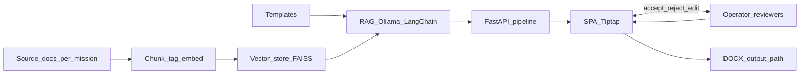

# Agentic RAG MVP — Project Master Document

**Read this file first.** It is the single entry point for motivation, product intent, current implementation, and where to go for deeper detail.

**Last updated:** 2026-05-20

---

## Table of contents

1. [Purpose and how to use this doc](#1-purpose-and-how-to-use-this-doc)
2. [Executive summary](#2-executive-summary)
3. [Why this platform exists](#3-why-this-platform-exists)
4. [What the product is and is not](#4-what-the-product-is-and-is-not)
5. [Users, roles, and review workflow](#5-users-roles-and-review-workflow)
6. [Stakeholder value (proposal tone)](#6-stakeholder-value-proposal-tone)
7. [Current system vs target direction](#7-current-system-vs-target-direction)
8. [End-to-end workflow](#8-end-to-end-workflow)
9. [Architecture (current)](#9-architecture-current)
10. [Two execution paths](#10-two-execution-paths)
11. [Stack and dependencies](#11-stack-and-dependencies)
12. [Data model](#12-data-model)
13. [RAG pipeline](#13-rag-pipeline)
14. [Human-in-the-loop mechanics](#14-human-in-the-loop-mechanics)
15. [REST API and SSE](#15-rest-api-and-sse)
16. [Front-end](#16-front-end)
17. [Repository layout](#17-repository-layout)
18. [Key conventions and decisions](#18-key-conventions-and-decisions)
19. [How to run and develop](#19-how-to-run-and-develop)
20. [Adding a new report type](#20-adding-a-new-report-type)
21. [Technical capability inventory](#21-technical-capability-inventory)
22. [Documentation map](#22-documentation-map)
23. [Glossary](#23-glossary)

---

## 1. Purpose and how to use this doc

| Audience | Suggested path |
|----------|----------------|
| **Stakeholders / proposal writers** | §2 Executive summary → §3 Motivation → §6 Stakeholder value |
| **New engineers** | §2 → §9 Architecture → §10 Two paths → §17 Repository layout → §19 Run |
| **Cursor / coding agents** | Full doc once; then [PROJECT_CONTEXT.md](PROJECT_CONTEXT.md) for file-level detail while coding |
| **Roadmap / migration** | §7 Current vs target → [plans/derived/PLANNING_PACK_DERIVED_INDEX.md](plans/derived/PLANNING_PACK_DERIVED_INDEX.md) |

Sections labeled **(current)** describe shipped behavior in this repo. **(target/planned)** describes the planning pack’s desired end state, which may not be fully implemented.

---

## 2. Executive summary

**Agentic RAG MVP (Mission RAG)** is a locally hosted, **mission-isolated** workspace where operators draft CPT/mission reports with **evidence-grounded AI assistance** and **mandatory human review** before anything is applied or exported. Users create a mission with a source folder (pick-up) and output folder (drop-off); the system ingests documents, builds a per-mission index, proposes **section- and block-level** edits, and supports a formal **operator → crew lead → MEL** approval chain ending in `.docx` export.

**Canonical product sentence:**

> Mission-scoped, human-in-the-loop RAG workspace for collaborative document creation—Word/Docs-style editing, grounded AI suggestions, evidence-aware incremental updates, and formal mission review workflows.

**“Agentic” in this codebase:** Specialized generation paths (RMP, Timeline, AAR, SITREP) with distinct prompts and retrieval rules. **Orchestration is deterministic Python** in `server.py` and `src/pipeline.py`—there is **no** LLM router that chooses which agent runs.

---

## 3. Why this platform exists

**(Motivation — product intent from planning pack, aligned with MVP direction.)**

Long missions (e.g. multi-month CPT operations) produce **fragmented operator artifacts**—crew logs, findings, notes—that must be **aggregated and rewritten** into formal reports (RMP, Timeline, AAR, SITREP). Manual consolidation is slow, stressful, and error-prone.

The platform exists to:

- **Reduce time** to produce mission reports and plans.
- **Reduce operator stress** from manual aggregation and rewrite cycles.
- **Preserve trust** by grounding suggestions in mission evidence when evidence matters.
- **Keep humans decisional**—AI proposes; humans accept, reject, edit, and approve.
- **Isolate missions** so one mission’s corpus, drafts, and indexes never blend with another.

The MVP already demonstrates that **mission-isolated RAG**, **template-seeded reports**, **local indexing**, and **human review** can coexist in one environment. The ongoing engineering direction is to evolve from a reviewable report-generation MVP into a **document-first collaborative workspace** (see §7).

---

## 4. What the product is and is not

### What it is **(current + target)**

- An **AI-assisted report-writing workspace**
- A **collaborative mission document workspace** (shared drafts and review; not full Google-Docs-style live co-editing yet)
- A **mission-scoped RAG system** for grounded drafting and updating
- A **formal review and approval environment** for mission documents

### What it is not

- An **autonomous report generator** that silently rewrites content
- A **general mission management platform** unrelated to documents
- A **cross-mission knowledge lake** (no blending of mission corpora)
- A **generic internet-grounded writing assistant**
- A **chat-only** interface where the document is secondary

---

## 5. Users, roles, and review workflow

### Roles **(product model)**

| Role | Responsibility |
|------|----------------|
| **Operator / analyst** | Primary drafter; edits reports; requests AI help; accepts/rejects suggestions |
| **Crew lead** | Reviewer; correctness gate; moves documents toward approval |
| **MEL** | Mission workspace owner; final approver; mission configuration authority |
| **Read-only** | View mission documents and states without editing **(target/planned)** |

### Review status **(current)**

Stored on each report as `review_status`:

`draft` → `in_review` → `crew_lead_approved` → `mel_approved` → `final`

Implemented in [src/report_review_service.py](../src/report_review_service.py) with enforced transitions on `PATCH .../review-status`, threaded **comments**, **approval log** events, and **finalize** export.

**Locks (current):**

- **AI updates** (pipeline Update, inline assist) blocked when status is `mel_approved` or `final`.
- **Content edits** (save, apply, accept pending, reset) blocked when status is `final` (reopen: `final` → `draft`).

### Auth and members **(current — partial vs pack)**

The server exposes `/api/auth/*` (login, logout, register, bootstrap, users, me) and mission **members** (`GET/POST/DELETE .../members`). Permission checks exist for sensitive actions (e.g. finalize). Full enterprise IAM and read-only role polish remain **(target/planned)** in the planning pack.

---

## 6. Stakeholder value (proposal tone)

For copy-paste into briefs, see also [PLATFORM_VALUE_PROPOSAL.md](PLATFORM_VALUE_PROPOSAL.md).

**Lead:**

> By combining mission-scoped, evidence-grounded RAG with section-level AI suggestions and a formal human-in-the-loop review workflow, our platform helps operators turn distributed mission artifacts into unified, approvable mission reports—without applying AI changes until they are explicitly accepted and approved.

**Approval chain:**

> Operators work in structured mission reports; AI proposes changes with evidence references; crew leads and MEL review status, comments, and approval before documents are finalized and exported.

**How it works (five steps):**

1. **Access:** Users log into the mission workspace and open mission-scoped reports (RMP, Timeline, AAR, SITREP).
2. **Ingest:** Operator and mission source files are ingested into a **per-mission** vector index (isolated from other missions).
3. **Draft with AI:** As operators write, the system offers **section- and block-level** suggestions grounded in retrieved mission evidence; inline assist supports on-demand help in the editor.
4. **Collaborate on one draft:** Contributions from mission artifacts and multiple editors feed **shared report drafts** within the same mission workspace.
5. **Protect with humans in the loop:** AI never silently overwrites the document—users **accept or reject** each proposal; reports move through the review chain with an approval log before export.

---

## 7. Current system vs target direction

| Area | **Current (MVP)** | **Target (planning pack)** |
|------|-------------------|----------------------------|
| AI workloads | Structured full-report updates + inline assist; both routed through server pipeline patterns | **Separate** fast inline assist vs heavy grounded update jobs |
| Editor | Tiptap/ProseMirror, proposed-changes panel, preview highlights | Word/Docs-like polish, tracked suggestions, richer collaboration |
| Collaboration | Shared mission workspace, comments, presence API; not full real-time co-editing | Live presence, richer comment/review UX |
| Updates | Incremental context via manifest + `last_used_doc_paths`; section hints telemetry | True scoped section generation, coverage-mode jobs |
| Orchestration | Python-only | Optional future LLM orchestrator calling same HTTP contracts |
| Data model | SQLite missions/reports/pending_edits + review tables | Full workspace entities, durable job/suggestion model |

**Roadmap entrypoints:**

- [plans/derived/PLANNING_PACK_DERIVED_INDEX.md](plans/derived/PLANNING_PACK_DERIVED_INDEX.md)
- [plans/derived/PART_D_04_MIGRATION_PHASES.md](plans/derived/PART_D_04_MIGRATION_PHASES.md)
- Raw pack: [plans/planning_pack/00_README.md](plans/planning_pack/00_README.md) (read 01 → 02 → 03 → 04)

---

## 8. End-to-end workflow

### Narrative **(current)**

1. **Input:** Per-mission source folder—`.txt`, `.pdf`, `.docx` (not Excel/CSV today).
2. **Normalization:** Load → chunk (1000 / 200 overlap) → tag `doc_type` (`crew_log`, `findings`, `other`) → embed → FAISS/Chroma per mission.
3. **Templates:** RMP, Timeline, AAR, SITREP HTML skeletons with `data-section-key`; template-as-query for retrieval and prompts.
4. **RAG:** Ollama + LangChain; report-specific retriever; structured JSON block edits; fallback full-draft RAG + synthetic pending edit.
5. **Backend:** FastAPI orchestrates index (when needed), structured edits, SQLite state, SSE; writes `.docx` on accept/save/apply/finalize.
6. **Front-end:** SPA; Tiptap editor; proposed-changes panel; Update/Reset; review strip.
7. **Human:** Accept/reject edits; edit directly; advance review status; finalize.
8. **Output:** Mission `output_path` receives approved `.docx` files.

### Diagram **(current)**




---

## 9. Architecture (current)

```
User (browser)  →  http://localhost:8000
       ↓
  index.html + Vite bundle (app + Tiptap) + styles  (Liquid Glass SPA)
       ↓
  FastAPI (server.py)  ← uvicorn
       ├── REST /api/...  (missions, reports, auth, members, pipeline-jobs, …)
       ├── SSE  /api/stream/{mission_id}/{report_type}
       └── Static  web/dist when built, else web/
       ↓
  Pipeline (background thread): index if missing; structured edits ×4 report types;
       fallback RAG; set_pending_edits; SSE notify
       ↓
  src/: mission_service, report_service, index, retrieve, agents, templates, ingest, …
       ↓
  SQLite (data/agentic_rag.db) + data/indexes/<mission_id>/
```

- **Single UI:** FastAPI + Liquid Glass SPA only (Streamlit removed).
- **Pipeline thread:** Daemon; clears `stream_buffers` at start so stale SSE does not mix with new runs.
- **Export:** DB is source of truth for drafts; `output_path` `.docx` on accept, save, apply, finalize.

---

## 10. Two execution paths

**Critical:** UI and scheduler/CLI do not behave identically.

| Aspect | **FastAPI / UI path** | **Scheduler / CLI path** |
|--------|------------------------|---------------------------|
| **Entry** | `request_mission_update` → `_run_pipeline` in `server.py` | `run_mission_cycle` in `src/pipeline.py`; `run.py`; `run_scheduler.py` |
| **Report types** | All four: `rmp`, `timeline`, `aar`, `sitrep` | **RMP and Timeline only** |
| **Index** | Rebuild only if `mission_index_exists` is false | **Always** full `build_mission_index` |
| **Generation** | Structured block edits + fallback; incremental when `last_used_doc_paths` set | Template-as-query RAG; `set_pending` for rmp/timeline |
| **Artifacts** | DB + UI; `.docx` on accept/save/apply | Also `output/<mission_id>/rmp_draft.txt`, `timeline_draft.txt` via CLI |

Treat the **UI path** as the full product surface.

---

## 11. Stack and dependencies

| Layer | Technology |
|-------|------------|
| **Server** | FastAPI, uvicorn |
| **Front-end** | TypeScript (`web/app.ts`, `web/tiptap-editor.ts`), Vite → `web/dist/`, Tiptap/ProseMirror |
| **RAG** | LangChain (loaders, splitter, retriever, ChatOllama, chains) |
| **Vector store** | FAISS default; optional Chroma (`VECTOR_STORE_TYPE=chroma`) |
| **Embeddings** | sentence-transformers `all-MiniLM-L6-v2` default; optional Ollama embeddings |
| **LLM** | Ollama default `phi3`; optional per-report URLs or `OLLAMA_NUM_PARALLEL=2` |
| **DB** | SQLite `data/agentic_rag.db` |
| **Scheduler** | APScheduler daily 02:00 (`python run_scheduler.py`) |
| **Export** | `python-docx` via `html_to_docx.py` |

**Config:** `config/settings.py` + `.env` — `OLLAMA_*`, `EMBEDDING_*`, `DATA_DIR`, `MISSIONS_DIR`, `INDEX_DIR`, `OUTPUT_DIR`.

---

## 12. Data model

### `missions` **(current)**

`id`, `name`, `source_path`, `output_path`, `status`, timestamps, optional metadata (`cpt`, `workflow_title`, dates, `operators`, `mel`, CCL fields, `auto_update_frequency`), Phase 4 checkpoint fields (`last_source_checkpoint_*`), ingest settings as implemented.

### `reports` **(current)**

PK `(mission_id, report_type)` — `current_content`, legacy `pending_content` fields, `pending_edits`, `review_status`, `last_used_doc_paths`, revision pointers where enabled.

### `pending_edits` **(current)**

Block-level proposals: `edit_id`, `section_id`, `target_block_id`, `operation`, `reason`, `evidence_refs`, `old_html`, `new_html`, `status`, `ord`.

### Review **(current)**

- `report_comments` — threaded comments per report
- `report_approval_events` — audit log for status changes and finalize

### Mission ID

Derived from mission name via `_slug` (lowercase alphanumerics + underscores).

---

## 13. RAG pipeline

### Ingestion **(current)**

- **Formats:** `.txt`, `.pdf`, `.docx`
- **`infer_doc_type`:** path hints → `crew_log` | `findings` | `other`
- **`build_mission_index`:** load → chunk → `by_type/*.json` + FAISS/Chroma + `manifest.json` (path, mtime, doc_type)

### Retrieval **(current)**

| Report type | Chunk sources |
|-------------|---------------|
| `timeline` | `crew_log` only |
| `rmp`, `aar`, `sitrep` | `crew_log` + `findings` + `other` |

`FixedListRetriever` when by-type JSON exists; else semantic FAISS `k=8`.

### Generation modes **(current)**

1. **Structured edits (primary):** LLM returns JSON array of block edits; validate `target_block_id`; dedupe near-duplicates; `set_pending_edits`.
2. **Fallback:** Full-draft RAG → `merge_llm_into_draft` → synthetic pending edit for UI parity.
3. **Inline assist:** Small-k semantic retrieval when index exists; suggestion only (no pending row).
4. **Incremental updates:** `get_new_docs_context_for_report` when `last_used_doc_paths` set; manifest diff for new/changed files.

### Evidence **(current)**

- `GET /api/missions/{id}/evidence-delta` — overview card for new/changed sources
- Checkpoint updated on save / accept / apply accepted edits

---

## 14. Human-in-the-loop mechanics

- AI **never** silently applies to `current_content`—proposals sit in `pending_edits` (or legacy `pending_content`).
- **Preview:** `GET .../preview` merges pending edits with highlight spans for Tiptap.
- **Per edit:** accept / reject; **bulk:** accept-all / reject-all; accept triggers **apply** (auto in UI).
- **Direct edit:** `POST .../save` updates `current_content` and can write `.docx`.
- **Reset:** single-report skeleton from template; clears pending state; sets `review_status` to `draft`.
- **Sources** shown in UI for reviewer trust; not required footnotes in delivered `.docx`.

---

## 15. REST API and SSE

Base prefix: `/api`. Below is the **core surface**; see `server.py` for the full list.

### Missions and reports

| Method | Path | Purpose |
|--------|------|---------|
| GET/POST | `/missions` | List / create |
| GET/PATCH/DELETE | `/missions/{id}` | Get / status / delete |
| PATCH | `/missions/{id}/metadata` | Workflow metadata |
| GET | `/missions/{id}/evidence-delta` | New/changed evidence summary |
| GET/POST/DELETE | `/missions/{id}/members` | Mission membership |
| GET | `/missions/{id}/reports/{type}` | Report row |
| POST | `/missions/{id}/reports/{type}/update` | Run pipeline for one type |
| POST | `/run-pipeline` | Run all report types |

### Edits and content

| Method | Path | Purpose |
|--------|------|---------|
| GET | `.../preview` | HTML with pending highlights |
| GET | `.../pending-edits` | Structured edit list |
| POST | `.../edits/{id}/accept` \| `reject` | Per-edit |
| POST | `.../accept-all-edits` \| `reject-all-edits` | Bulk |
| POST | `.../apply-edits` | Apply accepted to `current_content` |
| POST | `.../save` | User HTML → DB + optional `.docx` |
| POST | `.../accept` \| `reject` | Legacy pending content |
| POST | `.../reset` | Template skeleton |
| POST | `.../inline-assist` | Scoped editor suggestion |

### Review **(Phase 5 — current)**

| Method | Path | Purpose |
|--------|------|---------|
| PATCH | `.../review-status` | Status transitions |
| GET/POST | `.../comments` | Threaded comments |
| DELETE | `.../comments/{id}` | Remove comment |
| GET | `.../approval-log` | Audit events |
| POST | `.../finalize` | MEL final export |

### Other **(current)**

| Method | Path | Purpose |
|--------|------|---------|
| GET | `/status` | `running_mission_id` |
| GET | `/missions/{id}/pipeline-jobs` | Job list / detail |
| GET/POST | `/auth/*` | Login, users, session |
| POST | `/missions/{id}/build-index` | Force index build |
| GET | `/missions/{id}/documents` | Source document listing |
| POST | `.../export/pdf` | PDF export where enabled |
| GET/POST | `/missions/{id}/presence` | Presence heartbeat |
| GET/POST | `/missions/{id}/chat` | Mission/report chat |
| GET | `/stream/{mission_id}/{report_type}` | **SSE** live stream |

---

## 16. Front-end

- **SPA** hash routes: `#/`, `#/new`, `#/mission/<id>/overview`, `#/mission/<id>/<report_type>`, `#/mission/<id>/documents`
- **Editor:** Tiptap + custom `reportSection` nodes matching template `data-section-key`
- **Panels:** Proposed changes, preview highlights, review status strip, comments, approval log, finalize
- **Actions:** Update (5-minute client timeout), Reset with confirm, inline assist bubble/dock
- **Build:** `npm run build` → `web/dist/`; server prefers dist when present
- **Legacy:** Do not hand-edit `app.js`; source is `app.ts`

---

## 17. Repository layout

For the authoritative per-file table, see [PROJECT_CONTEXT.md §4](PROJECT_CONTEXT.md#4-repository-layout-every-important-file). Summary:

| Area | Key files |
|------|-----------|
| **Root** | `server.py`, `run.py`, `run_scheduler.py`, `requirements.txt`, `package.json`, `vite.config.ts` |
| **config/** | `settings.py` |
| **src/** | `db/models.py`, `mission_service.py`, `report_service.py`, `report_review_service.py`, `pipeline.py`, `agents/`, `index/`, `retrieve/`, `ingest/`, `templates/`, `document_blocks.py`, `inline_assist_service.py`, `evidence_checkpoint.py`, … |
| **web/** | `index.html`, `main.ts`, `app.ts`, `tiptap-editor.ts`, `report-section-extension.ts`, `styles.css` |
| **data/** | `agentic_rag.db`, `indexes/<mission_id>/`, `missions/` |
| **scripts/** | `clear_mission_reports.py` |
| **docs/** | This file, `PROJECT_CONTEXT.md`, `PROJECT_DEEP_SUMMARY.md`, `PLATFORM_VALUE_PROPOSAL.md`, `plans/` |

---

## 18. Key conventions and decisions

- **No Streamlit** — FastAPI + SPA only.
- **No LLM orchestrator** — Python decides report order (`REPORT_DEPENDENCIES`, topological sort).
- **Stream buffers cleared** at pipeline start for affected reports.
- **Mission id** from `_slug`; lookups mix exact id and `LOWER(id)` for status updates.
- **Structured edits first** for all four types; fallback + synthetic edit keeps one UI path.
- **Index skip** on UI update when `mission_index_exists`.
- **Four report types** in UI pipeline; scheduler path still RMP+Timeline only.
- **DOCX filenames:** `Risk_Mitigation_Plan.docx`, `Mission_Timeline.docx`, `After_Action_Report.docx`, `SITREP.docx`.

---

## 19. How to run and develop

```bash
# From project root
uvicorn server:app --host 0.0.0.0 --port 8000   # http://localhost:8000

npm install && npm run build   # after TS/UI changes

python run_scheduler.py        # optional daily 02:00 jobs

python run.py build <mission_id> [--source PATH]
python run.py run <mission_id> [--sequential]
python run.py all <mission_id>
```

**Ollama** must be running (default `phi3`). See project README if present for parallel Ollama setup.

---

## 20. Adding a new report type

1. Prompts in `src/templates/prompts.py` (template query, generation, structured edit).
2. HTML template in `src/templates/document_templates.py`.
3. `REPORT_TYPES` in `src/db/models.py` + `create_mission` seed row.
4. `REPORT_SPECS`, `STRUCTURED_EDIT_SPECS`, `USE_STRUCTURED_EDITS_FOR`, dependencies in `server.py`.
5. `REPORT_DOC_TYPES` in `src/retrieve/retriever.py` if retrieval differs.
6. Labels and API usage in `web/app.ts`.
7. `.docx` filename in `report_service`.

---

## 21. Technical capability inventory

Use this list to draft a technical paragraph; group as needed.

**Platform:** Locally hosted web app; mission-scoped isolation; long-running mission support; optional daily scheduler.

**UI:** Liquid Glass SPA; hash routing; Tiptap/ProseMirror; structured report sections; proposed-changes panel; SSE streams; inline assist; review/comments/approval UI.

**API:** FastAPI REST + SSE; auth and mission members; pipeline jobs; evidence delta; chat and presence endpoints where enabled.

**Data:** SQLite missions/reports/pending_edits/comments/approval events; per-mission FAISS/Chroma; `by_type` chunk JSON; ingest manifest.

**RAG:** LangChain ingest/chunk/embed; report-specific retrieval; structured block edits; full-draft fallback; context cleaning; edit deduplication; incremental new/changed file context.

**LLM:** Ollama (phi3 default); template-as-query agents; temperature-controlled structured JSON generation.

**HITL:** Accept/reject/apply per block; preview highlights; review status machine; finalize export; locks on approved/final reports.

**Output:** HTML drafts in DB; `.docx` (and optional PDF) to mission output path on commit/finalize.

**Not claimed:** Cross-mission KB; autonomous silent rewriting; full real-time multi-user editing; Excel/CSV ingest.

---

## 22. Documentation map

| Document | Audience | When to read |
|----------|----------|--------------|
| **PROJECT_MASTER.md** (this file) | Everyone | First read — whole picture |
| [PROJECT_CONTEXT.md](PROJECT_CONTEXT.md) | Engineers, agents | File-by-file map, detailed flows |
| [PROJECT_DEEP_SUMMARY.md](PROJECT_DEEP_SUMMARY.md) | Engineers | Deep dive: dual pipeline, API tables, schema |
| [PLATFORM_VALUE_PROPOSAL.md](PLATFORM_VALUE_PROPOSAL.md) | Stakeholders | Proposal wording only |
| [solution_workflow_visual_spec.md](solution_workflow_visual_spec.md) | Designers | Diagram node labels and flow |
| [plans/planning_pack/01–04](plans/planning_pack/00_README.md) | Product + eng leads | Target architecture and migration |
| [plans/derived/](plans/derived/PLANNING_PACK_DERIVED_INDEX.md) | Implementers | Phased checklists vs codebase |

---

## 23. Glossary

| Term | Meaning |
|------|---------|
| **RMP** | Risk Mitigation Plan |
| **Timeline** | Mission Timeline report |
| **AAR** | After Action Report |
| **SITREP** | Situation Report |
| **CPT** | Mission/customer context (mission documents) |
| **MEL** | Mission lead; final approver |
| **Mission / workspace** | Isolated unit: source path, output path, indexes, reports |
| **Structured edit** | LLM-proposed block change (JSON), not silent merge |
| **Pending edit** | Proposal awaiting accept/reject |
| **Template-as-query** | Retrieval query derived from report template |
| **by_type** | Chunk store split into crew_log / findings / other |
| **HITL** | Human-in-the-loop — mandatory review before apply |

---

*End of PROJECT_MASTER.md.*
