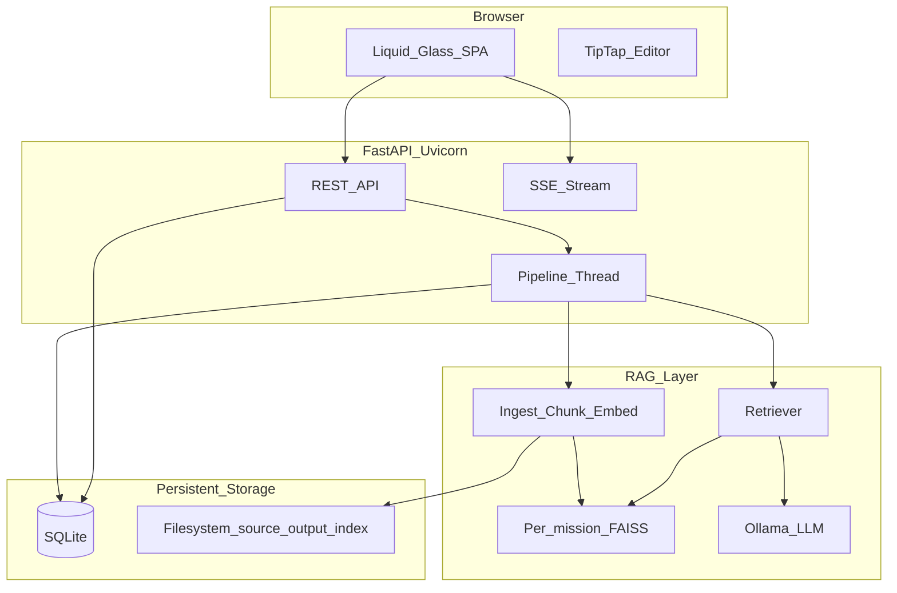

# Project Standing Master Document

**Project:** CyberScribe (formerly Agentic RAG MVP)
**Author context:** Aaron Quiroga — CPT operator; Lincoln Laboratory program
**Presentation:** *Collaborative AI for Cyber Mission Planning, Analysis, and Reporting*
**Paper:** RAG architecture for cyber mission planning and report writing
**Document purpose:** Single exhaustive snapshot of mission, goals, current standing, architecture, features, experiments, assets, and limitations
**Last updated:** 2026-06-03
**Companion docs:** [PROJECT_MASTER.md](PROJECT_MASTER.md) (engineering entry), [PROJECT_CONTEXT.md](PROJECT_CONTEXT.md) (file map)

> Historical project snapshot. Current installation and run instructions are in [README.md](../README.md). The alternate streaming server, daily-ingestion stub, Quill build, and their unused dependencies were retired after this snapshot.

---

## Table of contents

1. [Mission, motivation, and goals](#1-mission-motivation-and-goals)
2. [What the product is and is not](#2-what-the-product-is-and-is-not)
3. [Stakeholders and review workflow](#3-stakeholders-and-review-workflow)
4. [Current project standing (executive summary)](#4-current-project-standing-executive-summary)
5. [System architecture](#5-system-architecture)
6. [RAG pipeline (detailed)](#6-rag-pipeline-detailed)
7. [Human-in-the-loop and editor UX](#7-human-in-the-loop-and-editor-ux)
8. [Authentication, RBAC, and mission isolation](#8-authentication-rbac-and-mission-isolation)
9. [Report types and templates](#9-report-types-and-templates)
10. [API surface](#10-api-surface)
11. [Data model and persistence](#11-data-model-and-persistence)
12. [Front-end application](#12-front-end-application)
13. [Two execution paths (UI vs CLI/scheduler)](#13-two-execution-paths-ui-vs-clisscheduler)
14. [Technology stack and configuration](#14-technology-stack-and-configuration)
15. [Benchmark and experiments (complete record)](#15-benchmark-and-experiments-complete-record)
16. [Evaluation assets (gold set, judge, demo)](#16-evaluation-assets-gold-set-judge-demo)
17. [Paper and presentation alignment](#17-paper-and-presentation-alignment)
18. [Repository layout (every major component)](#18-repository-layout-every-major-component)
19. [Automated tests](#19-automated-tests)
20. [Known limitations and risks](#20-known-limitations-and-risks)
21. [Future work](#21-future-work)
22. [Documentation map](#22-documentation-map)
23. [Glossary](#23-glossary)

---

## 1. Mission, motivation, and goals

### Operational problem (CPT context)

Cyber Protection Teams conduct defensive cyber operations on government networks using Weapon Systems. Missions follow structured, document-intensive workflows: **planning → briefing → executing → debriefing (report writing)**. Operators produce fragmented artifacts—crew logs, crew notes, findings—that must be manually reviewed, organized, and consolidated into formal products (RMP, Timeline, AAR, SITREP).

**Pain points:**

- Planning and reporting are **time-intensive and manual**, reducing time for analysis, follow-on investigation, and execution.
- Extending execution time **lengthens the mission**, reducing how many operations a CPT can run annually.
- **Public cloud AI is unacceptable** for classified mission artifacts; support must run **locally on the Weapon System**.
- Reporting requires **human review and accountability**—AI cannot silently commit changes.

### Project mission

Build a **locally hosted, mission-scoped, evidence-grounded RAG platform** that:

- Ingests mission artifacts and document templates
- Retrieves relevant evidence from the mission corpus
- Generates **draft updates as reviewable proposals** (structured block edits and inline assist)
- Keeps **operators in control** via accept/reject and formal review status
- **Isolates each mission** so corpora, indexes, and drafts never blend

### Canonical product sentence

> Mission-scoped, human-in-the-loop RAG workspace for collaborative document creation—Word/Docs-style editing, grounded AI suggestions, evidence-aware incremental updates, and formal mission review workflows.

### Program goals (engineering)

| Goal | Status |
|------|--------|
| Mission-isolated ingest, index, and retrieval | **Shipped** |
| Four report types in UI pipeline (RMP, Timeline, AAR, SITREP) | **Shipped** |
| Structured block-level edits with HITL | **Shipped** (reliability varies by model) |
| Inline assist (cursor/selection actions) | **Shipped** |
| Review chain (draft → MEL → final) + comments | **Shipped** |
| `.docx` export on save/apply/finalize | **Shipped** |
| Local Ollama LLM + optional local embeddings | **Shipped** |
| Benchmark comparing local models on structured edits | **Done** (n=100 publication set) |
| Unit testing environment deployment | **Planned** |
| True section-scoped generation / adaptive orchestration | **Target / not shipped** |
| Full real-time collaborative editing | **Target / not shipped** |

### What “agentic” means here

Specialized generation paths per report type with distinct prompts and retrieval rules. **Orchestration is deterministic Python** in `server.py` and `src/pipeline.py`—there is **no** LLM router that chooses which agent runs.

---

## 2. What the product is and is not

### It is

- An **AI-assisted report-writing workspace**
- A **collaborative mission document workspace** (shared drafts, comments, presence—not full Google Docs co-editing)
- A **mission-scoped RAG system** for grounded drafting and updating
- A **formal review and approval environment**

### It is not

- An **autonomous report generator** that silently rewrites content
- A **general mission management platform** unrelated to documents
- A **cross-mission knowledge lake**
- A **generic internet-grounded writing assistant**
- A **chat-only** interface where the document is secondary

---

## 3. Stakeholders and review workflow

### Roles

| Role | Responsibility |
|------|----------------|
| **Operator / analyst** | Primary drafter; edits reports; requests AI help; accepts/rejects suggestions |
| **Crew lead (CCL)** | Reviewer; correctness gate |
| **MEL** | Mission workspace owner; final approver; mission configuration |
| **Viewer** | Read-only (partial; target polish) |

### Review status (per report)

`draft` → `in_review` → `crew_lead_approved` → `mel_approved` → `final`

Implemented in `src/report_review_service.py`: status transitions, threaded comments, approval log, finalize export.

### Locks

- **AI updates** (pipeline Update, inline assist) blocked when `review_status` is `mel_approved` or `final`
- **Content edits** blocked when status is `final` (reopen: `final` → `draft`)

---

## 4. Current project standing (executive summary)

### Shipped MVP capabilities

- Browser SPA with mission control, overview, and TipTap document editor
- FastAPI backend with REST + SSE streaming for pipeline progress
- Per-mission FAISS index, SQLite state, filesystem source/output paths
- Structured edit pipeline for all four report types with fallback path
- Inline assist: rewrite, fill placeholder, next sentence, findings continuation, timeline gap, etc.
- RBAC with session cookies and mission membership roles
- Benchmark harness with n=100/model structured-edit comparison (phi3, gemma2:2b, llama3.2:3b)
- Demo seeding and screenshot capture for presentation
- Gold eval set (`data/eval/rmp_gold/`) for RMP checklist/rubric and incremental deltas

### Recent engineering (2026 session highlights)

- **Fill placeholder:** Section-scoped prompts, evidence attribution (not all retrieved files), replace-vs-insert fix, template blank-line spacing, `ReportParagraph` class preservation
- **Findings gap:** RMP numbered finding list continuation (`Finding N+1` with matching risk level)—mirrors timeline gap pattern
- **Structured edit reliability mitigations:** JSON mode, parse hardening, benchmark mode, invoke timeouts
- **Publication figures:** experiment3 folder = relabeled figures from `experiment2_mitigated_n100` (300 trials)

### Primary benchmark conclusion (presentation/paper)

On identical sample-mission RMP structured-edit trials (n=100 per model, 300s job / 210s invoke caps):

| Model | All-trial mean gen (s) | Structured success | Success-only mean gen (s) |
|-------|------------------------|--------------------|---------------------------|
| gemma2:2b | 15.4 | 100% (100/100) | 15.4 |
| phi3 | 21.9 | 44% (44/100) | 27.6 |
| llama3.2:3b | 201.6 | 7% (7/100) | 89.0 |

**Recommendation:** gemma2:2b best **reliability–latency** tradeoff for local structured-edit workflow on target hardware.

### Success criterion (benchmark)

A trial is **successful** if the model produced at least one **valid, mission-grounded block edit** to the RMP ready for **human review** within benchmark time limits. This is **pipeline-defined** (accepted edits, no parse failure, no full-draft fallback)—**not** LLM-as-judge scoring. The n=100 publication run used **`--skip-judge`** for runtime; judge is available in smaller benchmark runs.

---

## 5. System architecture



### Layers

1. **Browser front end** — TypeScript SPA, TipTap editor, proposed-change highlights, inline assist widgets
2. **Backend** — FastAPI + Uvicorn; coordinates API, pipeline jobs, auth, export
3. **RAG layer** — LangChain + Ollama; ingest, embed, retrieve, prompt, generate
4. **Persistent storage** — SQLite (drafts, edits, review, users) + filesystem (indexes, source docs, `.docx` output)

---

## 6. RAG pipeline (detailed)

### Ingestion

| Step | Implementation |
|------|----------------|
| Formats | `.txt`, `.pdf`, `.docx` (not Excel/CSV) |
| Loaders | `src/ingest/loaders.py` — `load_file`, `infer_doc_type` |
| Doc types | `crew_log`, `findings`, `other` |
| Chunking | `RecursiveCharacterTextSplitter`: **1000 chars**, **200 overlap** |
| Normalize | Whitespace normalization in `chunking.py` |
| Embed | HuggingFace `all-MiniLM-L6-v2` (default) or Ollama `nomic-embed-text` (benchmark) |
| Index | FAISS default (`VECTOR_STORE_TYPE=faiss`); Chroma optional |
| Manifest | `src/ingest/manifest.py` — path, mtime, doc_type for incremental diff |
| By-type cache | `data/indexes/<mission_id>/by_type/{crew_log,findings,other}.json` |

### Retrieval (hybrid—not pure k-NN everywhere)

| Report type | Strategy | Doc types |
|-------------|----------|-----------|
| `timeline` | **FixedListRetriever** — all crew_log chunks | `crew_log` |
| `rmp`, `aar`, `sitrep` | **FixedListRetriever** when by_type JSON exists | `crew_log`, `findings`, `other` |
| Legacy / inline assist | **Semantic top-k** over FAISS (`k=4–8`) | Filtered by mission |

**Important for Q&A:** RMP structured-edit pipeline updates often load **the full typed chunk set** for bounded sample missions, not only top-k semantic neighbors. Inline assist and some assist paths use **k-nearest embedding similarity** via FAISS.

### Generation modes

1. **Structured edits (primary UI path)** — LLM returns JSON array of block edits; validate `target_block_id`; dedupe; `set_pending_edits`
2. **Fallback** — Full-draft RAG + merge into template + synthetic pending edit for UI parity (skipped in `BENCHMARK_MODE=1`)
3. **Inline assist** — Fast scoped LLM; gap-aware paths (timeline row, finding row, placeholder); in-editor Accept/Reject without DB pending row by default
4. **Incremental updates** — `update_intent=update_from_evidence`; `get_new_docs_context_for_report` + manifest diff when `last_used_doc_paths` set

### LLM parameters (typical)

| Path | Temperature | Notes |
|------|-------------|-------|
| Structured edit (JSON) | 0.1 | Ollama `format: json` when enabled |
| Structured edit (text) | 0.2 | |
| Inline assist | 0.3 (0.1 for fill/findings gap) | |
| Chat | 0.2 | |
| Benchmark judge | 0 | `benchmark_judge.py` |

### Quantization

Not configured in application code. **Ollama model packages** (e.g. `gemma2:2b`) ship with quantized weights; check with `ollama show <model>` on deployment hardware.

---

## 7. Human-in-the-loop and editor UX

### Structured pipeline edits

- LLM proposes `pending_edits` with `old_html`, `new_html`, `target_block_id`, `reason`, `evidence_refs`
- UI: **Proposed changes** panel + in-document preview highlights
- Operator: **Accept** / **Reject** per edit or bulk; accept triggers apply to `current_content` and `.docx` write
- **Reset** restores document template via `reset_report_to_template()`

### Inline assist

- **Selection actions:** rewrite, shorten, expand, formalize, operationalize, to_bullets, to_paragraph, fill_placeholder
- **Cursor actions:** suggest_next_sentence, insert_paragraph, fill_placeholder
- **Pending widget:** green highlight + Accept/Reject (`inline-assist-pending.ts`)
- **Gap-aware behavior:**
  - `timeline_gap.py` — fill missing timeline bullet between timestamps
  - `findings_gap.py` — append `Finding N+1` with same risk level as previous finding
  - `fill_placeholder.py` — section-scoped fill; rejects outlines/raw log dumps; evidence synthesis fallback

### Evidence display

- `evidence_attribution.py` filters retrieved docs to those supporting suggestion text
- Inline assist returns `evidence_sources` for operator review

---

## 8. Authentication, RBAC, and mission isolation

### Auth

- `src/auth_service.py` — bcrypt passwords, HTTP-only session cookies
- Endpoints: login, logout, bootstrap (first MEL/admin), register, users, me
- Middleware on protected routes

### Mission members

- `mission_members` table: roles `operator`, `crew_lead`, `mel`, `viewer`
- Roster provisioned from mission creation form (operators, CCL, MEL)
- Permission asserts on finalize, review transitions, sensitive edits

### Mission isolation

Each mission has:

- Unique `mission_id` (slug from name)
- Dedicated `source_path` and `output_path`
- Dedicated FAISS index under `data/indexes/<mission_id>/`
- Scoped SQLite rows (reports, edits, jobs keyed by `mission_id`)

No cross-mission retrieval or blending.

---

## 9. Report types and templates

| `report_type` | Display title | Retrieval doc types | Export filename |
|---------------|---------------|---------------------|-----------------|
| `rmp` | Risk Mitigation Plan | crew_log, findings, other | `Risk_Mitigation_Plan.docx` |
| `timeline` | Mission Timeline | crew_log only | `Mission_Timeline.docx` |
| `aar` | After Action Report | crew_log, findings, other | `After_Action_Report.docx` |
| `sitrep` | SITREP | crew_log, findings, other | `SITREP.docx` |

### Section model

- `src/section_definitions.py` — `SECTION_DEFINITION_SEED` (section_key, display_title, sort_order, policy)
- `src/templates/document_templates.py` — HTML with `<section class="report-section" data-section-key="…">`
- Placeholders: `[To be filled from mission data]` with blank-line spacing (`template-blank-line`, `template-placeholder`)

### Prompts

- `src/templates/prompts.py` — template-as-query, generation prompts, **structured edit prompts** per report type, JSON suffix
- `src/templates/inline_assist_prompts.py` — inline action instructions and fill-placeholder builders

---

## 10. API surface

Base: `/api`. Auth via session cookie.

### Auth
`POST /auth/login|logout|bootstrap|register|users` · `GET /auth/me`

### Missions
CRUD missions · metadata · members · documents · build-index · activity · export/bundle · presence · auxiliary knowledge · chat · evidence-delta

### Reports (per type)
GET report · save · reset · update · preview · blocks · pending-edits · accept/reject edits · apply-edits · inline-assist · review-status · comments · approval-log · finalize · export/pdf · revisions · chat

### Pipeline
`POST /run-pipeline` · `GET /missions/{id}/pipeline-jobs[/{job_id}]` · `GET /status` · **SSE** `/stream/{mission_id}/{report_type}`

### Debug (admin)
`GET /debug/global` · `/missions/{id}/debug`

### SPA
`GET /` and catch-all → `web/dist` or `web/`

Full detail: `docs/PROJECT_DEEP_SUMMARY.md`, `server.py`.

---

## 11. Data model and persistence

### SQLite (`data/agentic_rag.db`)

| Table | Purpose |
|-------|---------|
| `missions` | Workspace metadata, paths, CPT fields, checkpoint, lifecycle |
| `reports` | `current_content`, `review_status`, `last_used_doc_paths`, `content_json` |
| `pending_edits` | Block-level AI proposals |
| `pipeline_jobs` | Durable jobs, progress JSON, `update_intent`, status |
| `report_comments` | Threaded comments with anchors |
| `report_approval_events` | Audit log |
| `report_revisions` | Numbered HTML checkpoints |
| `report_section_definitions` | Section catalog |
| `users`, `user_sessions` | Auth |
| `mission_members` | RBAC |
| `chat_messages` | Mission/report chat |
| `mission_presence` | Heartbeats |
| `auxiliary_knowledge_sources` | Extra retrieval sources |

### Filesystem

| Path | Purpose |
|------|---------|
| `DATA_DIR/missions/<id>/` or configured source_path | Mission pick-up documents |
| `OUTPUT_DIR` / mission output_path | Drop-off `.docx` |
| `INDEX_DIR/<mission_id>/faiss/` | Vector index |
| `INDEX_DIR/<mission_id>/by_type/` | Typed chunk JSON |
| `INDEX_DIR/<mission_id>/manifest.json` | Incremental ingest manifest |

---

## 12. Front-end application

| File | Role |
|------|------|
| `web/index.html` | App shell |
| `web/main.ts` | Vite entry |
| `web/app.ts` | Routing, API, SSE, mission/report UI, review strip |
| `web/tiptap-editor.ts` | Editor, toolbar, inline assist bubble/dock |
| `web/report-section-extension.ts` | `reportSection` nodes |
| `web/report-comment-extension.ts` | Comment anchors |
| `web/inline-assist-pending.ts` | Accept/Reject staging widget |
| `web/styles.css` | Liquid Glass + editor styles |
| `web/review-rail-explainer.html` | Review workflow explainer |

Build: `npm run build` → `web/dist/` served by FastAPI.

---

## 13. Two execution paths (UI vs CLI/scheduler)

| Aspect | **UI (`server.py`)** | **CLI/scheduler (`pipeline.py`)** |
|--------|----------------------|-----------------------------------|
| Entry | Update button / API | `run.py`, `run_scheduler.py` |
| Report types | All four | **RMP + Timeline only** |
| Index | Build if missing | **Always full rebuild** |
| Generation | Structured edits + fallback | Template RAG agents |
| Artifacts | DB + `.docx` | Also `*_draft.txt` in output |

**Treat UI path as the product.**

---

## 14. Technology stack and configuration

### Python (`requirements.txt` highlights)

langchain ≥0.3 · langchain-community · faiss-cpu · sentence-transformers · fastapi · uvicorn · python-docx · bcrypt · apscheduler · pypdf · xhtml2pdf · python-dotenv

### Node (`package.json`)

vite ^8 · typescript ~5.3 · @tiptap/* ^3.20

### Environment (`.env.example`)

| Variable | Default / notes |
|----------|-----------------|
| `OLLAMA_BASE_URL` | `http://127.0.0.1:11434` |
| `OLLAMA_MODEL` | `gemma2:2b` (example); code default `phi3` |
| `EMBEDDING_PROVIDER` | `sentence-transformers` |
| `EMBEDDING_MODEL` | `all-MiniLM-L6-v2` |
| `VECTOR_STORE_TYPE` | `faiss` |
| `DATA_DIR`, `INDEX_DIR`, `OUTPUT_DIR` | Under project or absolute paths |

Benchmark scripts set `EMBEDDING_PROVIDER=ollama`, `EMBEDDING_MODEL=nomic-embed-text`, `BENCHMARK_MODE=1`.

---

## 15. Benchmark and experiments (complete record)

**Harness:** `scripts/llm_benchmark.py`
**Judge (optional):** `scripts/benchmark_judge.py` — grounding 1–5, hallucination flag, checklist recall; default judge `llama3.2:3b`, cross-judge `phi3` when subject is Llama

### Structured success definition (code)

```
structured_success = (accepted_edit_count > 0) AND NOT parse_failed AND NOT fallback_used
```

### Experiment matrix

| Experiment ID | Description | n/model | Models | Key flags | Output dir |
|---------------|-------------|---------|--------|-----------|------------|
| **(root)** | Legacy / default harness | 10 | phi3, llama3.2:3b, gemma2:2b | judge optional | `output/benchmark/` |
| **experiment2** | Canonical structured-edit benchmark | 10 | all three | judge on, 300s timeout | `output/benchmark/experiment2/` |
| **experiment2_pilot** | Early n=2 (recovered from SQLite) | 2 | all three | judge | `output/benchmark/experiment2_pilot/` |
| **experiment2_mitigated** | JSON-mode mitigations | 10 | all three | `--skip-judge`, 300s | `output/benchmark/experiment2_mitigated/` |
| **experiment2_mitigated_n100** | Overnight scale run | **100** | all three | `--skip-judge`, 300s, `--resume` | `output/benchmark/experiment2_mitigated_n100/` |
| **experiment2_llama_fair_n20** | Llama-only diagnostic | 20 | llama3.2:3b | `--skip-judge`, isolated figures | `output/benchmark/experiment2_llama_fair_n20/` |
| **experiment3** | **Publication figure folder** | 100 (copied) | all three | Data from mitigated_n100 | `output/benchmark/experiment3/` |
| **experiment3 (original intent)** | Incremental `update_from_evidence` + deltas | 5 | llama, gemma | judge on, `llm_benchmark_inc` | Worker script only |

### experiment3 folder (publication)

Per `output/benchmark/experiment3/README.txt`:

- **Figures and paper charts** sourced from `experiment2_mitigated_n100/results.csv` (300 rows)
- **NOT** the original incremental delta experiment (that was n=5, different intent)
- `update_intent` in copied data: **`full_refresh`**
- Caps: **300s job**, **210s LLM invoke**
- **Judge skipped** at n=100 (`--skip-judge`)

### Figure file mapping (correct)

| Figure file | Plots |
|-------------|-------|
| `fig3_phase_breakdown.png` | **All trials** — mean generation latency |
| `fig_paper_pipeline_phases.png` | **Successful trials only** |
| `fig_paper_structured_reliability.png` | Success vs fallback rates |
| `fig2_structured_success_rate.png` | Success/fallback bar chart |
| `fig4_phase_breakdown_log.png` | Retrieval / generation / parse breakdown (log scale) |

### Canonical experiment2 (n=10) documented results

From `docs/paper/benchmark_results_section.txt` (with judge):

- Structured success ~30–40% per model; fallback ~60–70%
- Judge grounding ~3.2–4.0 on 1–5 scale (pilot n=10)

### Hardware (benchmark)

Local CPU workstation (~16 GB RAM), sequential trials, Ollama local inference—results are environment-specific.

---

## 16. Evaluation assets (gold set, judge, demo)

### `data/eval/rmp_gold/`

| Asset | Purpose |
|-------|---------|
| `seed_rmp.html` | Gold RMP HTML (demo screenshots, eval seed—not live benchmark output) |
| `checklist.json` | Checklist items for judge scoring |
| `RUBRIC.md` | Judge rubric text |
| `deltas/trial_01.txt` … `trial_05.txt` | Incremental finding lines for experiment3-style updates |

### Demo tooling

| Script | Purpose |
|--------|---------|
| `scripts/seed_demo_rmp.py` | Load seed into product mission (e.g. `test1`) — **not** benchmark missions |
| `scripts/capture_demo_screenshots.py` | Playwright → `output/demo/screenshots/` |

### Benchmark missions (do not overwrite for experiments)

- `llm_benchmark` — primary benchmark mission
- `llm_benchmark_inc` — incremental experiment3 setup

---

## 17. Paper and presentation alignment

### Presentation script topics

- CPT problem → local HITL RAG solution
- Architecture diagram (ingest → FAISS → LangChain → Ollama gemma2:2b)
- Mission workflow slides (login, mission control, overview, document draft)
- Benchmark: 100 trials × 3 models; success definition; two latency charts
- Future work: unit deployment, retrieval quality, adaptive orchestration

### Paper sections (draft status)

| Section | Status |
|---------|--------|
| Introduction, Background, Related Work | Drafted |
| System Architecture (Backend, Front end) | Drafted |
| **RAG Pipeline** | **Empty — needs text** |
| **Persistent Storage** | **Empty — needs text** |
| Test Cases | Drafted; **figure order/captions must match fig3 then fig_paper** |
| Limitations, Conclusion | Drafted |

### Alignment notes

- Use **structured edit** (no hyphen) in new prose
- Do **not** claim LLM-as-judge defined success for n=100 run
- Sample mission corpus—not operational classified export
- Product demo may use **seed_rmp.html** as example draft (label as demo fixture)

---

## 18. Repository layout (every major component)

### Root executables

| File | Purpose |
|------|---------|
| `server.py` | Primary FastAPI application |
| `run.py` | CLI build/run/all |
| `run_scheduler.py` | Daily ingestion scheduler |

### `config/settings.py`

Environment loader: Ollama, embeddings, paths, timeouts, per-report Ollama URLs.

### `src/` modules (complete list)

**Core services:** `mission_service.py`, `report_service.py`, `report_review_service.py`, `revision_service.py`, `pipeline_job_service.py`, `pipeline.py`

**Auth & members:** `auth_service.py`, `mission_member_service.py`

**RAG:** `index/build.py`, `index/vectorstore.py`, `retrieve/retriever.py`, `ingest/loaders.py`, `ingest/chunking.py`, `ingest/manifest.py`

**Generation:** `agents/base.py`, `agents/report_agents.py`, `templates/prompts.py`, `templates/document_templates.py`, `templates/inline_assist_prompts.py`, `document_blocks.py`, `structured_edits_json.py`, `merge_draft.py`, `edit_dedupe.py`

**Grounded update / inline:** `inline_assist_service.py`, `grounded_update/gap_spec.py`, `grounded_update/timeline_gap.py`, `grounded_update/findings_gap.py`, `grounded_update/fill_placeholder.py`, `grounded_update/evidence_attribution.py`, `grounded_update/retrieval.py`, `grounded_update/policy.py`, `grounded_update/draft_dedupe.py`, `grounded_update/pipeline_gap_hints.py`

**Supporting:** `section_definitions.py`, `sections.py`, `evidence_checkpoint.py`, `html_to_docx.py`, `pdf_export.py`, `chat_service.py`, `presence_service.py`, `activity_service.py`, `auxiliary_service.py`, `admin_debug_service.py`, `documents_registry.py`, `utils/context_cleaner.py`, `utils/llm_invoke.py`

**DB:** `db/models.py`

### `scripts/` (complete list)

`llm_benchmark.py`, `benchmark_judge.py`, `run_benchmark_10trials.ps1`, `run_benchmark_10trials_worker.ps1`, `run_experiment2_*.ps1` (unattended, detached, resume, mitigated, mitigated_n100, mitigated_n100_resume), `run_experiment3.ps1`, `run_experiment3_worker.ps1`, `run_llama_fair_diagnostic.ps1`, `recover_experiment2_pilot.py`, `cleanup_benchmark_state.py`, `stop_benchmark_and_cleanup.ps1`, `keep_awake.ps1`, `seed_demo_rmp.py`, `capture_demo_screenshots.py`, `clear_mission_reports.py`, `bootstrap_linux_venv.sh`, `pack_for_linux.ps1`, `smoke_uvicorn.sh`

### `docs/`

`PROJECT_MASTER.md`, `PROJECT_CONTEXT.md`, `PROJECT_DEEP_SUMMARY.md`, `PLATFORM_VALUE_PROPOSAL.md`, `solution_workflow_visual_spec.md`, `paper/*`, `plans/planning_pack/*`, `plans/derived/*`

### `tests/`

See §19.

---

## 19. Automated tests

| File | Covers |
|------|--------|
| `tests/test_timeline_gap.py` | Timeline neighbor parse, chunk filter, validation, gap_spec |
| `tests/test_findings_gap.py` | Finding continuation parse, validation, gap classification |
| `tests/test_fill_placeholder.py` | Outline rejection, evidence synthesis |
| `tests/test_evidence_attribution.py` | Supporting-doc filter for evidence line |
| `tests/test_report_docx.py` | HTML → DOCX export |

Run: `python -m unittest discover tests`

**No** automated API, browser, or end-to-end tests; manual QA in `TESTING.md`.

---

## 20. Known limitations and risks

### Product

- Not cross-mission knowledge sharing
- Not autonomous silent rewrite
- Not full real-time co-editing
- Limited ingest formats (no Excel/CSV)
- Section-scoped pipeline generation still future; `sections.py` is telemetry only
- CLI/scheduler path lags UI (2 report types, always rebuild index)

### Structured edits / models

- Local 3B-class models: structured success often 30–44% without mitigations; phi3 parse failures significant at n=100
- Fallback path historically 60–70% on canonical n=10
- Placeholder-heavy templates challenge edit quality
- Results hardware- and corpus-specific

### Benchmark methodology

- n=100 improves stability but judge skipped at scale
- Fixed retrieval lists for RMP—not pure semantic ablation
- experiment3 folder relabels mitigated_n100 data (full_refresh, not incremental deltas)

### Operational / security

- SQLite single-file concurrency limits
- MVP dev passwords in roster provisioning—must harden for ops
- Formal accreditation for classified deployment not completed
- Ollama VRAM/queue contention (documented for llama)

---

## 21. Future work

From presentation, paper, and planning pack:

1. **Initial deployment** in unit testing environment on weapon-system hardware
2. **Retrieval quality** — section-aware queries, reranking, better chunking
3. **Multi-modal normalization** — broader ingest formats and normalization
4. **Adaptive workflow orchestration** — route assist by mission phase and report type
5. **Suggestion process** — faster, higher-quality structured edits; larger or tuned models
6. **Workflow integration** — reduce friction with existing CPT review/approval processes
7. **Planning pack targets** — dual-write ProseMirror JSON, durable job model, scoped section generation, richer collaboration UX

---

## 22. Documentation map

| Read when… | Document |
|------------|----------|
| First engineering read | [PROJECT_MASTER.md](PROJECT_MASTER.md) |
| **Current standing (this doc)** | [PROJECT_STANDING_MASTER.md](PROJECT_STANDING_MASTER.md) |
| File-by-file coding | [PROJECT_CONTEXT.md](PROJECT_CONTEXT.md) |
| Deep API/schema | [PROJECT_DEEP_SUMMARY.md](PROJECT_DEEP_SUMMARY.md) |
| Stakeholder copy | [PLATFORM_VALUE_PROPOSAL.md](PLATFORM_VALUE_PROPOSAL.md) |
| Benchmark paper text | [paper/benchmark_results_section.txt](paper/benchmark_results_section.txt) |
| Structured edit reliability | [paper/STRUCTURED_EDIT_RELIABILITY.md](paper/STRUCTURED_EDIT_RELIABILITY.md) |
| Roadmap vs code | [plans/derived/PLANNING_PACK_DERIVED_INDEX.md](plans/derived/PLANNING_PACK_DERIVED_INDEX.md) |

---

## 23. Glossary

| Term | Meaning |
|------|---------|
| **CPT** | Cyber Protection Team |
| **CCL** | Cyber Crew Lead |
| **MEL** | Mission Element Lead |
| **RMP** | Risk Mitigation Plan |
| **AAR** | After Action Report |
| **SITREP** | Situation Report |
| **RAG** | Retrieval Augmented Generation |
| **HITL** | Human-in-the-loop |
| **Structured edit** | Block-level JSON edit proposal (`target_block_id`, `new_html`) |
| **Inline assist** | Fast scoped editor action (rewrite, fill placeholder, etc.) |
| **Structured success** | Benchmark trial: valid accepted block edit, no parse fail, no fallback |
| **Pending edit** | AI proposal awaiting accept/reject |
| **FixedListRetriever** | Returns full typed chunk list (ignores query) |
| **update_intent** | Pipeline job mode: `full_refresh`, `update_from_evidence`, etc. |
| **Weapon System** | Government cyber operations platform/hosting environment |

---

*End of Project Standing Master Document.*
